  

  
  
  
  
  
  

---

I build pricing and optimization systems — the kind with a business decision waiting at the
other end. Five years in, mostly across FMCG, biopharma, healthcare and aerospace, and mostly
on problems where the modelling is only half the job and the other half is making the answer
land with the people who have to act on it.

Right now I'm at **Aria Intelligent Solutions** in Kolkata, working on a geospatial pricing
engine and a platform that turns a plain-English pricing instruction into a solved optimization
model. Alongside that I run **[DatabreaksAI](https://www.databreaksai.co.in/)**, a small school
for people trying to get into data careers.

## Work I keep coming back to

| | What it does | Built with |
|---|---|---|
| **Geospatial pricing engine** | Computes branch-level price percentiles using 2D KS distribution similarity, proximity logic and customer segmentation, with auto-recovery when a branch has too little data | BigQuery, Python |
| **AI price optimization** | Reads a plain-English instruction, detects the optimization intent, parses objectives and constraints, runs simulations, then formulates and solves the LPP | LLMs, PuLP, Python |
| **SPS switching-matrix explorer** | Symmetric SKU × SKU switching analysis across single and multi-attribute configurations — the picture at the top of this page. Took the analysis from days to minutes | Streamlit, pandas |
| **[ReclyticsAI](https://reclyticsai.streamlit.app/)** | Five agents — parser, summarizer, segmentation, recommendation, chat — reading research papers on free-tier models | Groq, Gemini, Ollama |
| **[PyTestIQ](https://pytestiq.streamlit.app/)** | Points at a repo or a zip and generates a pytest suite, coverage report and code-relationship graph | Agentic AI, pytest, Groq |
| **RiskAI** | Compliance assistant over RBI Master Directions: hybrid FAISS + BM25 retrieval with RRF, cross-encoder reranking, HyDE expansion, gap analysis | CrewAI, FAISS, Groq |
| **[LTF credit risk suite](https://github.com/B-Soumya/credit-risk)** | PD/LGD/EAD model tournament on 255K loans, expected loss, WOE scorecards, fraud and early warning, SHAP explanations | XGBoost, LightGBM, SHAP |

## Open source

**[llm-flops](https://pypi.org/project/llm-flops/)** — estimates FLOPs, memory, latency, energy
and cost for a transformer LLM analytically, without downloading a single weight. Useful when
you want to know what an architecture will cost before you commit to it.
[`B-Soumya/LLM-FLOPS`](https://github.com/B-Soumya/LLM-FLOPS)

**[keytext](https://pypi.org/project/keytext/)** — keyword-based text extraction, packaged so it
stops being the same 200 lines copied between notebooks.

Also published: *An ML Approach for Predicting Groundwater Quality (SDG 6.0)*, in
**Data and AI for Sustainability**, Taylor & Francis.

## What the work has been worth

| | |
|---|---|
| 99.8% faster | SmartArt hierarchy extraction and PPG volume aggregation, hours down to seconds |
| 98% less functional time | Amex P-Card reconciliation rebuilt in Python |
| 97.5% less analysis time | SPS switching-matrix explorer |
| 94% saved | Vizient Vistex optimization in SQL and SSIS |
| 30% more accurate | GPT-4 fine-tuned on medical voice-of-customer data |
| 1M+ records | Real-time NLP on Azure OpenAI, Databricks and PySpark |

## Contributions, in three dimensions

  

## Tools

  

Day to day that means Python and SQL over BigQuery, Snowflake and SQL Server; PySpark on
Databricks; PuLP for the optimization; LangChain and LangGraph with GPT-4, Claude, Gemini and
Groq; Streamlit and FastAPI for anything anyone else has to touch; Power BI, Tableau and
Spotfire when the audience lives in dashboards.

## Background

Master's in Biostatistics from the International Institute for Population Sciences on a
Government of India fellowship, after Statistics, Mathematics and Computer Science at
Ramakrishna Mission Residential College. Lean certified and Green Belt trained. Started out
doing research at the Indian Statistical Institute, Kolkata, and on a groundwater-quality
project for Bangladesh with KTH, UNICEF and DPHE.

The GitHub numbers, if you want them

 

  
  

## Elsewhere

[LinkedIn](https://www.linkedin.com/in/soumyajit-basak996/) ·
[Website](https://sites.google.com/view/basakstat) ·
[DatabreaksAI](https://www.databreaksai.co.in/) ·
[Book a call](https://topmate.io/soumyajit_basak) ·
[soumyajit.basak2014@gmail.com](mailto:soumyajit.basak2014@gmail.com)

If you're working on pricing, optimization or applied GenAI and want a second opinion, my inbox
is open.
